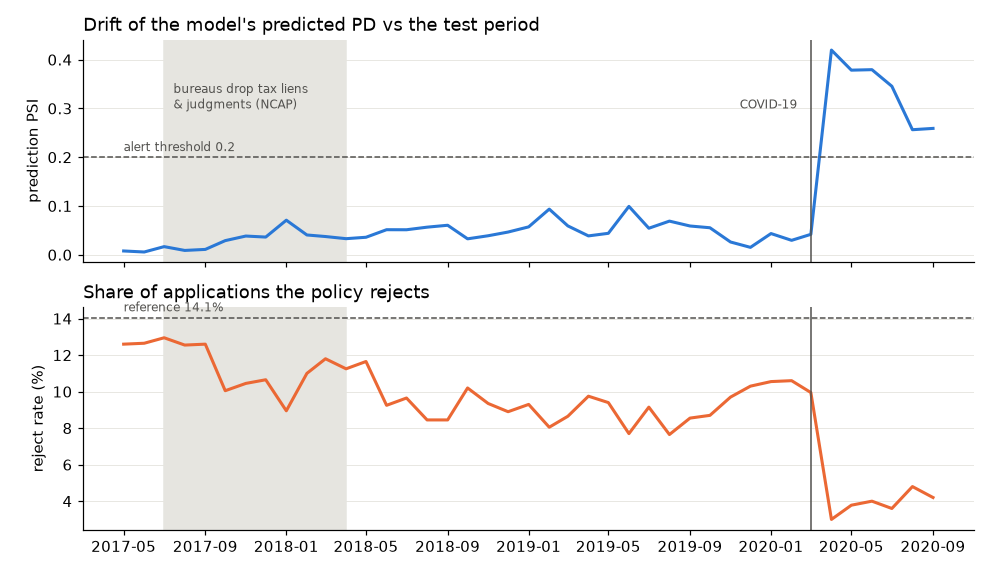

# RiskFlux

Production-grade ML pipeline for loan default prediction on Lending Club data (2007–2020Q3).

The model is intentionally simple (LightGBM). The focus is the infrastructure around it:
reproducible data + pipeline versioning, train/serve parity, experiment tracking, a model
registry with promotion, a containerized inference API, drift monitoring, automated
retraining, and a model card.

## Status
🚧 Step 9 done — Evidently drift monitoring on replayed production traffic

## Stack
Python 3.11 · uv · DVC · pandera · LightGBM · MLflow · FastAPI · Docker · Evidently · GitHub Actions · GCP Cloud Run

## Setup
```bash
uv sync                 # create .venv from uv.lock
uv run dvc pull         # fetch versioned raw data from DagsHub (needs a DagsHub token, see below)
```
DagsHub credentials (stored in `.dvc/config.local`, never committed):
```bash
uv run dvc remote modify origin --local access_key_id <DAGSHUB_TOKEN>
uv run dvc remote modify origin --local secret_access_key <DAGSHUB_TOKEN>
```

## Pipeline
Defined in `dvc.yaml` (ingest → clean → split → train → evaluate, plus ablation); parameters in `params.yaml`.
```bash
uv run dvc pull         # get every stage output for the current commit (no recompute)
uv run dvc repro        # re-run only the stages whose code, data, or params changed
uv run dvc dag          # show the stage graph
uv run dvc metrics diff # compare split sizes / default rates with the last commit
uv run pytest           # unit tests (synthetic data, no download needed)
```
Stages can also run individually: `uv run python -m riskflux.data.{ingest,clean,split}`.

## Results
Out-of-time test set: 239,705 loans issued 2016-07 … 2017-04 (after everything the model saw).

| | |
|---|---|
| ROC-AUC | 0.688 (Lending Club's own interest rate as a score: 0.663) |
| Calibration error (ECE) | 0.005 |
| Loss avoided vs approving every loan | **$7.08M (2.9%)**, rejecting 13.9% of applications |

Details, caveats and ablations: [docs/DECISIONS.md](docs/DECISIONS.md).

## Experiment tracking & registry (MLflow on DagsHub)
Runs and registered models: [dagshub.com/riyansh100/riskflux.mlflow](https://dagshub.com/riyansh100/riskflux.mlflow) — current champion: `riskflux-pd` v1.

```bash
cp .env.example .env                                              # then add your DagsHub token
uv run --env-file .env python -m riskflux.registry.log_run        # log run + register as @challenger
uv run --env-file .env python -m riskflux.registry.promote        # promote to @champion if it's cheaper
```
`log_run` refuses to log if `dvc status` isn't clean or there are uncommitted changes, so every
registered version maps to one git commit and exact data hashes.

## Inference API (FastAPI + Docker)
```bash
uv run --env-file .env python -m riskflux.serving.fetch_model   # @champion -> build/model (md5-verified)
docker build -t riskflux:v1 .
docker run --rm -p 8080:8080 riskflux:v1                        # docs at http://localhost:8080/docs
```
| Endpoint | Purpose |
|---|---|
| `GET /health` · `GET /ready` | liveness · readiness (503 until the model is loaded) |
| `GET /metadata` | registry version, git commit, threshold |
| `POST /predict` · `POST /predict/batch` | PD, decision (`approve` / `reject` / `refer`), expected loss, top-3 reason codes, policy flags |

Local Docker benchmark (500 real loans, sequential): **p50 25 ms, p95 36 ms**. Container scores are
identical to the batch pipeline on 1,000 loans.

## Drift monitoring (Evidently)
81,718 later loans (2017-05 … 2020-09) replayed through the Docker API in time order; the drift job
compares each month of the API's prediction log to the test period (PSI on the 62 model inputs and on
predicted PD, plus missing rates).



It catches two real events: the credit bureaus dropping tax liens and civil judgments (2017-18),
and COVID-19 (prediction PSI 0.04 → 0.42 in April 2020). Details: [docs/DECISIONS.md](docs/DECISIONS.md).
```bash
PREDICTION_LOG_PATH=data/monitoring/predictions.jsonl uv run uvicorn riskflux.serving.app:app --port 8080
uv run python -m riskflux.monitoring.replay_traffic     # replay loans through the API
uv run python -m riskflux.monitoring.drift              # -> reports/drift/{drift_summary.json, drift_timeline.png}
```

## Data
- Source: [Lending Club 2007–2020Q3 on Kaggle](https://www.kaggle.com/datasets/ethon0426/lending-club-20072020q1)
- `scripts/download_data.sh` is a one-time bootstrap; the DVC remote is the source of truth.
- Population: 36-month individual loans issued 2013-01 … 2017-04 with a final outcome — 953,889 loans, 14.7% default.

## Design decisions
See [docs/DECISIONS.md](docs/DECISIONS.md) and [docs/COLUMN_AUDIT.md](docs/COLUMN_AUDIT.md).
